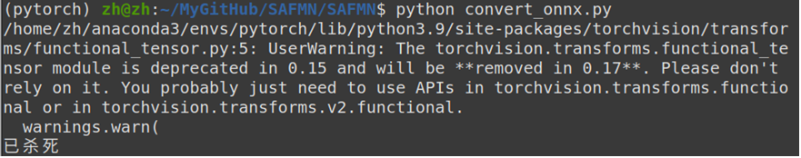
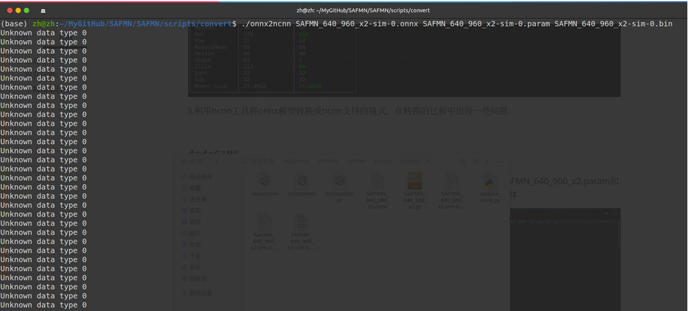
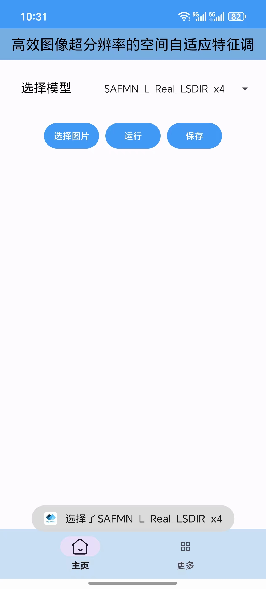
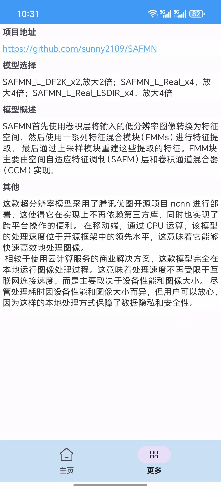
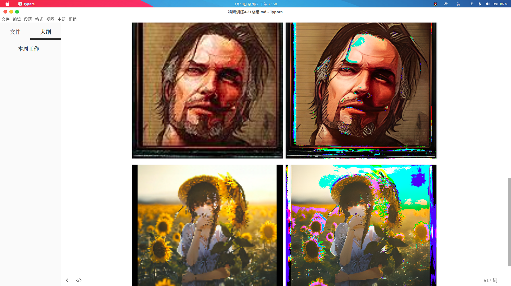

# SAFMN_Android
Deploying a deep learning model to Android.

部署深度学习模型到安卓端。

简要说明：模型是图片超分模型，地址：https://github.com/sunny2109/SAFMN

1.**转模型**。将训练好的模型文件（.pth）转成ncnn支持的模型文件。

Ncnn提供了两种途径将pytorch模型转换成ncnn支持的param和bin文件。分别是使用工具onnx2ncnn和pnnx(Pytorch Neural NetWork Exchange)。

最先开始使用的工具onnx2ncnn。onnx2ncnn工具的主要任务是将 ONNX 模型解析并转换为适用于 ncnn 的格式。所以先进行torch.onnx.export操作将pytorch模型转化成onnx模型。这里出现了第一个问题，由于转换模型是在本地电脑进行的，内存有限，当用于模拟模型的输入、随机生成的张量fake_x的后两个维度较大时，即图片的宽度和高度较大时，运行转换程序一段时间后进程被杀死。

只能缩小输入张量的size，所以最开始转换得到的onnx模型限制了输入的分辨率只能是128x128。得到onnx模型之后，使用onnx2ncnn得到ncnn支持的*.param和*.bin，在转换过程中出现了问题：onnx模型中存在ncnn不支持的数据类型。

为了验证转换得到的ncnn模型文件是否可以被正常加载使用，先在PC端验证该模型的效果，发现模型不能被正常加载。应该是部分数据结构不被支持，引起的模型不完整，从而出现错误。放弃了这个方法，使用pnnx转换模型。

Pnnx同样是ncnn 框架的模型转换工具，它与 onnx2ncnn 类似，但更专注于从 PyTorch 直接转换模型。主要用于将 PyTorch 的模型（通常是 .pth 格式）转换为 ncnn 框架能够加载的模型格式（.param 和 .bin 文件）。具体工作流程是，pnnx 使用 PyTorch 的 torch.jit.trace() 函数来跟踪模型的前向传播路径。这一阶段生成一个 PyTorch 的 TorchScript 模型，它保存了模型的结构和运算操作，供 pnnx 进一步解析和转换。pnnx 接收到由 torch.jit.trace 导出的 TorchScript 模型后，开始解析模型中的计算图、图优化、算子映射等，最后生成两个ncnn模型文件：param文件：网络结构文件，它包含了神经网络的拓扑结构和各个层的配置信息。这个文件以文本格式保存，描述了模型的网络结构和每一层的连接方式，包括层的类型、参数和输入输出信息；bin文件，权重文件，它包含了神经网络模型的权重、偏置等数据，这些数据是在训练过程中学习得到的。

2.**编写app界面**。使用Android Studio编写超分辨率模型app的前端页面。

App页面编写加入了一些流行的控件，比如Spinner,ViewPager 和 Fragment。Spinner 是一个类似下拉菜单的控件，用户可以从列表中选择一个选项。它通常用于选择性输入的场景，比如选择国家、性别等。在我们的app中负责选择不同的模型。ViewPager 是一个用于滑动切换页面的控件。它允许用户通过左右滑动的手势来翻页，常用于多页面切换的场景，比如图片轮播、标签页切换等。Fragment 是 Android 中的 UI 模块，能够在 Activity 中动态加载和替换。Fragment 是模块化的，常用于可重用的用户界面组件。通过ViewPager和Fragment的组合，可以在 ViewPager 中切换显示不同的 Fragment。相比activity，内存管理上，Fragment 具有更高效的内存管理，因为 Fragment 可以在后台保持不活动状态而不被销毁，从而节省了系统资源；模块化开发中，Fragment 可以将每个功能模块独立处理，避免了将所有功能集中在一个庞大的 Activity 中，提升了代码的可维护性；动态界面：通过 Fragment，应用可以根据不同的设备和屏幕尺寸动态加载不同的界面布局，这对于手机和平板等多种设备上的适配非常有用。

在底部又添加了导航栏，点击不同的标签（主页、更多），主界面的内容会切换。这种布局非常适合使用 Fragment 实现，每个标签页对应一个 Fragment，当用户点击导航栏中的不同按钮时，通过 FragmentManager 切换不同的 Fragment 来实现内容的动态加载。市面上流行的应用大多都使用了这种组合，例如微信、qq、微博等等。

 

3.**在Android Studio中集成ncnn**。

下载ncnn预编译库，添加NDK和CMake支持，编写CMakeLists.txt。

Android Studio 中使用 CMake 需要 NDK（Native Development Kit）的支持，因为 CMake 主要用于编译 C/C++ 代码，而 NDK 是 Android 提供的工具包，允许开发者在 Android 项目中编写和编译 C/C++ 代码，并将其与 Java/Kotlin 代码进行集成。在 Android Studio 中，CMake 与 NDK 结合使用，CMake 根据 CMakeLists.txt 文件描述的项目结构调用 NDK 工具链，完成代码的编译和链接，生成 .so 文件。

生成的共享库（.so文件），就是将ncnn环境集成到android studio。该共享库中包含对ncnn库的依赖。然后在Java类中声明本地方法并加载共享库（通过 System.loadLibrary() 加载 .so 文件），最后在推理代码中实现这些声明的方法，即可实现Android Studio中java与C++的通信。

4.**编写推理代码**。

这是整个模型部署的关键，决定了模型的实际效果。作用是安卓端调用ncnn的模型文件，执行推理并返回给前端。推理代码使用的是C++，而Android Studio编写app使用的是java。因此使用了java提供的编程接口jni，允许 Java 程序调用本地（Native）代码。

编写推理代码时，最开始出现了图片偏色的问题。原图片经过超分后，分辨率有显著提高，但出现偏色问题：

开始认为是加载图片时出现的问题，考虑了opencv读取图片时默认的通道顺序是BGR，而ncnn::Mat::from_pixels（）进行图像推理时，默认使用的通道顺序是RGB；也尝试使用stb库加载图片（stb 是一组单头文件的 C 库，旨在简化图形、图像和多媒体相关的开发与传统的库相比，stb 的设计原则是易于使用和集成，不需要复杂的安装和依赖管理）。都没有解决。最后发现是图片归一化问题，在执行推理时像素值超出了有效的颜色范围（0-255），因此需要对输出的像素值进行 clip（裁剪） 操作，先clip到（0，1），执行推理，然后再将结果乘以 255，以确保每个像素值都在合法的颜色范围内。因为对图像处理的经验不足，在这个问题上也花费了不少时间。好在最后也解决了这个问题。

